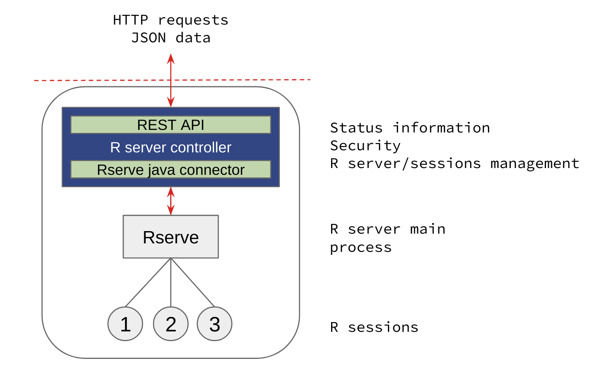
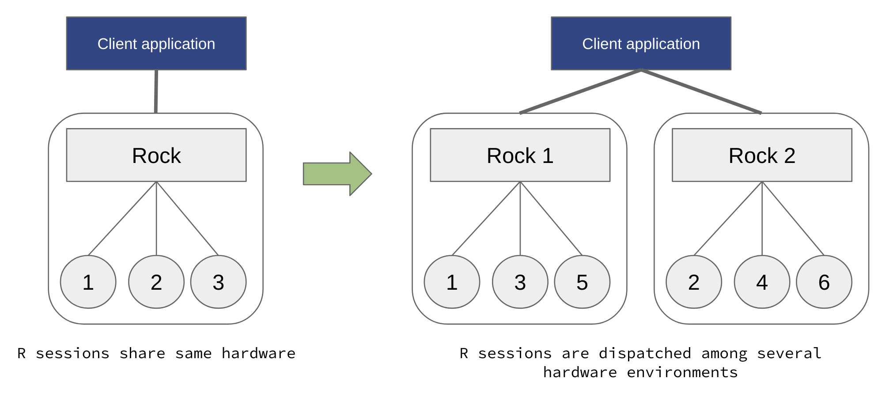
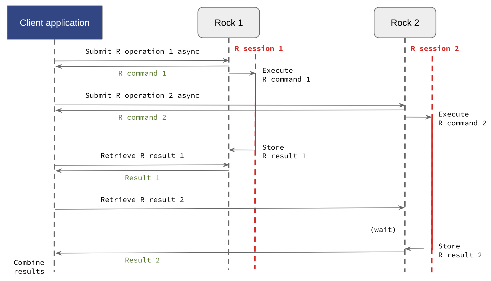
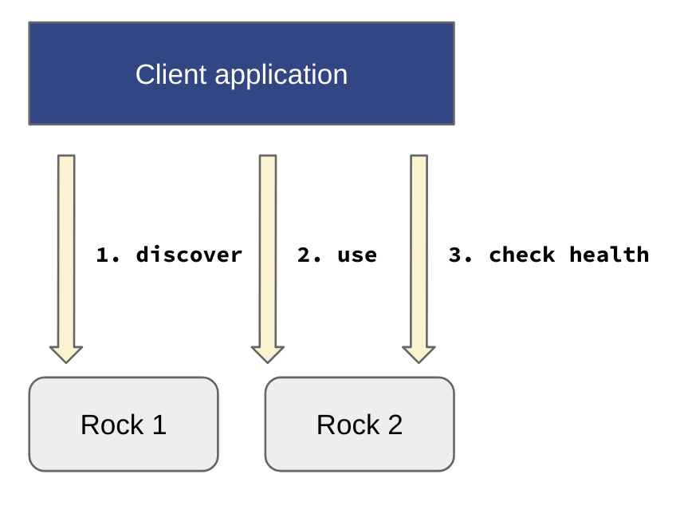
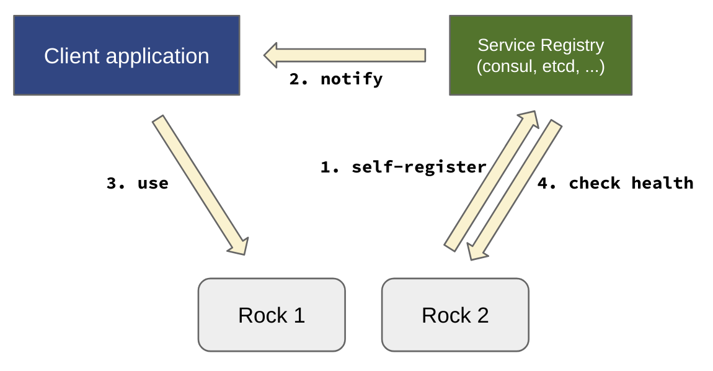

Introduction
============

Rock is a server application that provides a REST API to execute R operations on server side in the context of a stateful R session. Rock can be discovered or can self-register to build clusters for performing distributed computations.

Architecture
------------

The Rock frontend is a REST API that is implemented by a Java application. This application manages in the backend, a R server process (based on `Rserve <http://www.rforge.net/Rserve//>`_), creates R sessions and controls the lifecycle and the access to these R sessions. System status is reported to allow service registration and load balancing (see :ref:`rserver-rest` API documentation). This allows to constitute clusters of Rock servers.

  Rock architecture combines Java (frontend) and R (backend) applications, to build a secure and easy to use service.

Stateful R Sessions
-------------------

Unlike `OpenCPU <https://www.opencpu.org/>`_, the R sessions are stateful and then the interactions with the remote R session is very similar to the ones with a local R session. The main operations that can be performed on a remote R session are: assign, evaluate, upload/download file. See :ref:`session-rest` entry points documentation.

The consequence of this is that the hardware resources (memory, CPU) are consumed on a single R server throughout the R session life: this makes it potentially less robust in case of the R server is terminated abruptly. Another aspect is that R objects living in the remote R session memory are immediately available for computation, but can affect the overall performance of the server when the memory is not managed correctly by the client application. In the end it is a trade-off between the ease of use and the reliability. Rock is more suitable as an application's backend service (such as `Opal <http://www.obiba.org/pages/products/opal/>`_) than as a direct and general purpose R service (as proposed by `OpenCPU <https://www.opencpu.org/>`_).

Security
--------

Rock requires user authentication and authorization. The user registry is file-based.

The following user roles are defined:

* ``administrator``, can do anything.
* ``manager``, can only manage the R server: R process and R packages. Creating and using R sessions is not permitted.
* ``user``, can only create and use its own R sessions. R operations may be limited by the :ref:`config-apparmor`.

A `user` is not necessarily a human being, it can also be an application using Rock as a computation engine.

Scalability
-----------

When the computation needs grow, horizontal scalability consists of expanding the number of Rock servers, whereas vertical scalability consists of expanding the hardware resources on a single Rock server.

In order to balance the load appropriately, Rock allows to group server instances (using `tags` information) and provides detailed information about the R server status, like the total number of R sessions, the busy ones, the number of system cores (to reduce the concurrency between R sessions) and the amount of available free memory. More information could be added in the future, to allow more refined load balancing strategies. See :ref:`rserver-rest` Status API documentation.

  Add more Rock servers and balance the load to scale R services horizontally.

Distributed Computing
---------------------

As Rock offers the possibility to submit assignment and evaluation R operations in an asynchronous manner, a client application could use several Rock servers in parallel for dispatching the computation load on multiple hardware resources. Once all the managed R operations are completed, the results from each computed parts can be retrieved and combined. It would be fairly easy to implement such distributed computing process using the `rockr <https://github.com/obiba/rockr>`_ R package for instance. See :ref:`commands` API documentation.

One example of advanced distributed computing framework is `DataSHIELD <https://www.datashield.ac.uk/>`_, which is based on `Opal <http://www.obiba.org/pages/products/opal/>`_ and offers privacy-preserving features.

  R computations can be run in parallel and results be retrieved in a subsequent request, to be combined.

Service Registration
--------------------

When used as an application's backend service, Rock can be used directly or published in a registry.

Discovery
~~~~~~~~~

When discovering the Rock service, the application with registry knows the location (base URL) of the Rock servers. When connection is established by the application (requires credentials), the :ref:`service-rest` entry points allow the application to get node information and perform periodical availability checks.

For example, `Opal <http://www.obiba.org/pages/products/opal/>`_ application is able to discover Rock servers from their base URL and do automatic registration and unregistration of the services.

  Rock service discovery, use and health check.

Self-registration
~~~~~~~~~~~~~~~~~

In the self-registration process, Rock knows the location (base URL) of the registry. When connection is established by the Rock server (usually requires credentials), the :ref:`service-rest` entry points allow the registry to get node information and perform periodical availability checks.

Currently self-registration is proposed for `Consul <https://www.consul.io/>`_ (see :ref:`consul-config`) and `Opal <http://www.obiba.org/pages/products/opal/>`_ (see :ref:`opal-config`).

  Rock self-registration to a service registry.
